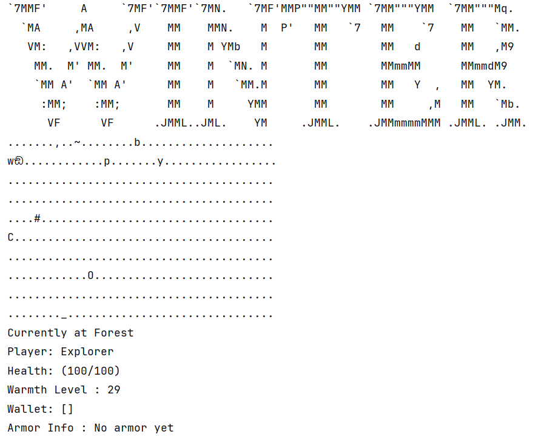

# Winter Survival: Object-Oriented Rogue-like Game (Java)

## 📌 Executive Summary
This repository contains the complete source code and design documentation for a text-based, rogue-like Winter Survival game developed in Java. The objective of this project is to demonstrate rigorous software engineering practices through the iterative development of a medium-to-large-scale software system. 

The game engine handles complex interactions between the player ("Explorer"), dynamic weather conditions, diverse flora and fauna, and external API integrations. The core focus of this project is the strict application of Object-Oriented Design (OOD) methodologies to ensure system extensibility, scalability, and maintainability.

## 🛠️ Core Engineering Practices
*   **Architectural Design:** Strictly adhered to **SOLID, DRY, KISS, and connascence** principles to manage coupling and cohesion across a growing codebase.
*   **Iterative UML Modeling:** Continuously updated UML class diagrams and comprehensive design rationales to document architectural trade-offs during system expansion.
*   **Quality Assurance:** Implemented extensive Unit Testing covering typical, boundary, and edge cases to guarantee deterministic behavior across all functional requirements.
*   **Industry Standards:** Maintained a clean Git version control history (15+ structural commits per iteration) and fully documented the system utilizing standard Javadoc and the Google Java Style guide.

---

## 🚀 Project Evolution (Iterative Agile Development)

### 🔹 Iteration 1: Core Mechanics & Foundations (v1.0)
*Established the base survival framework and applied foundational OOP concepts like Dependency Inversion (DIP) and Liskov Substitution (LSP).*
*   **Dynamic Survival System:** Developed an "Explorer" entity managing distinct survival attributes (hydration and warmth) alongside interactive items via `Drinkable` and `Sleepable` interface contracts.
*   **Hostile & Neutral Ecosystem:** Created a scalable `Animal` hierarchy. Predators feature innate combat behaviors utilizing intrinsic weapons, prioritized through `TreeMap` data structures.
*   **Complex Flora Life-cycles:** Implemented an extensible `FruitTree` system where distinct trees drop specific consumable items that uniquely impact the player's survival attributes.
*   **Advanced Wildlife Taming (HD Feature):** Developed a dynamic taming mechanic allowing the player to domesticate animals via a `Tamable` interface. Tamed entities dynamically transition behaviors, equipping `CollectBehaviour` or `FightBehaviour`.

### 🔹 Iteration 2: Team-Based System Expansion (v2.0)
*Collaborative development phase focusing on advanced software design patterns, reducing system connascence, and establishing robust API contracts for parallel team development.*
*   **Advanced Polymorphic Navigation:** Engineered a highly extensible teleportation network. By introducing the `Teleportable` interface and `TeleGround` abstractions, the teleportation logic was decoupled from concrete map elements.
*   **Decoupled Spawning Architecture:** Refactored static hard-coded mob generation into a dynamic, interface-driven `Spawnable` system, enabling seamless integration of new environmental triggers (e.g., Tundras, Caves).
*   **Connascence & Primitive Obsession Reduction:** Systematically refactored weapon stats and continuous effects into structured Enums (`WeaponType`, `StatusType`) and Abstract hierarchies (`ContinuousEffect`), eliminating magic numbers and minimizing connascence of meaning and position.
*   **State Design Pattern (HD Feature):** Architected stateful NPC entities (e.g., a multi-elemental Dragon). By delegating behavioral logic to isolated state classes (`FireState`, `IceState`) via the `DragonState` interface, the system avoids bloated conditional statements.

### 🔹 Iteration 3: Enterprise Patterns & API Integration (v3.0 - Final Release)
*The final development phase focused on eliminating unsafe type-casting, implementing advanced design patterns (Factories & Injectors), and bridging the game engine with external web services.*
*   **API-Driven Dynamic Economy (HD Feature):** Developed the "Mysterio Store" subsystem utilizing a `RandomPriceApi` to fetch real-time, randomized item values via external network calls. Engineered an automatic offline fallback to guarantee system resilience.
*   **Factory Pattern & Dependency Injection:** Overhauled the flora growth lifecycle and hostile spawning mechanics. By introducing Static Factory interfaces (`CreateAppleTrees`) and Injectors (`TeethInjector`), the system completely removes direct concrete dependencies.
*   **Type-Safe Equipment Architecture:** Refactored the entire armor and equipment management system to eradicate unsafe object downcasting (e.g., `instanceof` usage). Utilized object composition (`ArmorHolder`) and Interface Segregation to ensure compile-time safety.
*   **Self-Registering Currency Subsystem:** Engineered an automated, self-registering Diamond currency system. The `Wallet` container dynamically manages thresholds and automates currency combination logic completely independent of the core combat loop.
